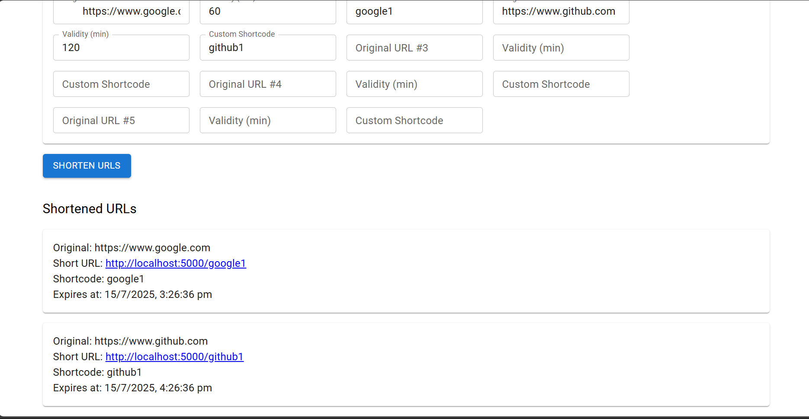

# Campus Hiring URL Shortener Microservice

## Overview
This project is a full-stack HTTP URL Shortener Microservice built for a campus hiring evaluation. It includes:
- A custom logging middleware
- Node.js + Express backend
- React + Material UI frontend

## Folder Structure
```
/Logging Middleware
/Backend Test Submission
/Frontend Test Submission
```

## Features
- Shorten URLs with optional custom shortcode and validity
- Redirect to original URLs
- Track and display analytics for each short URL
- Custom logging to a remote server

## Setup Instructions

### 1. Backend
```
cd "2218108/Backend Test Submission"
npm install
npm start
```
- Runs on [http://localhost:5000](http://localhost:5000)

### 2. Frontend
```
cd "2218108/Frontend Test Submission"
npm install
npm start
```
- Runs on [http://localhost:3000](http://localhost:3000)

### 3. Logging Middleware
- Used internally by both backend and frontend for logging events.

## Usage

### Shorten a URL
- Go to [http://localhost:3000/](http://localhost:3000/)
- Enter a long URL, validity (optional), and shortcode (optional)
- Click "Shorten URLs" to generate a short link

### View Statistics
- Go to [http://localhost:3000/stats](http://localhost:3000/stats)
- Enter a shortcode to view analytics

## Example API URLs
- **Shorten URL (POST):** `http://localhost:5000/shorturls`
- **Redirect:** `http://localhost:5000/<shortcode>`
- **Stats (GET):** `http://localhost:5000/shorturls/<shortcode>`

## Example Inputs
| URL                        | Validity (min) | Shortcode   |
|----------------------------|----------------|-------------|
| https://www.google.com     |                |             |
| https://www.wikipedia.org  | 60             |             |
| https://www.github.com     |                | mygithub    |
| https://www.notion.so      | 10             | notes2024   |
| https://www.example.com    | 5              | ex5         |

## Screenshots




*Main page where users can shorten URLs.*


*Display of a successfully shortened URL.*


*Error message shown when the input field is left empty.*


*Error message shown for an invalid URL input.*


*Statistics page showing usage data for a short URL.*


*Statistics page with location data for a short URL.*
